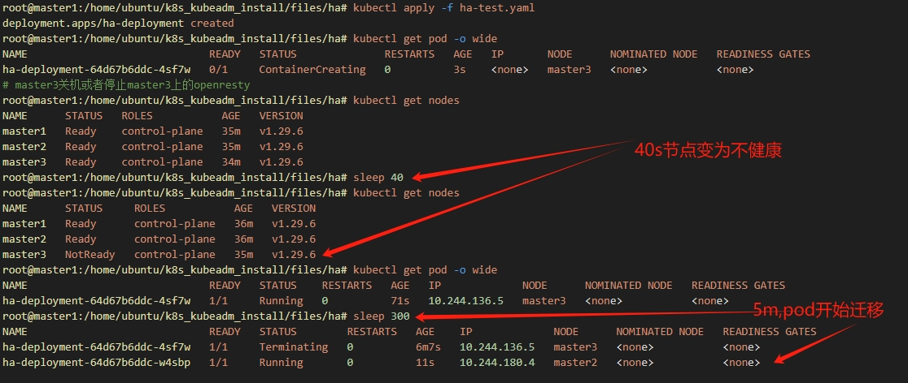

### 系统环境
ubuntu22.04
- 为什么采用openresty，因为它支持原生支持lua脚本，可以有很多扩展性
由于openresty的安装区别于ubuntu22.04版本以前和以后，此处只添加了22.04安装方式，20.04暂未适配  
其他版本可以自行修改
https://openresty.org/cn/linux-packages.html#ubuntu

- 命令执行
执行playbook为main-ubuntu2204-ha.yaml，其余步骤完全一样[How_to_run.md](../../How_to_run.md#ansible使用kubeadm方式一键安装k8s)  
```bash
ansible-playbook playbooks/main-ubuntu2204-ha.yaml
```
### 高可用集群

#### 集群规划
主机名 | IP | 用途 
------------|------------|------------
master1  | 172.16.1.35 | 集群主节点1
master2  | 172.16.1.36 | 集群主节点2
master3  | 172.16.1.37 | 集群主节点3


1. 安装openresty或nginx（所有主节点）
官方地址：https://openresty.org/cn/linux-packages.html#ubuntu  
添加hosts解析 127.0.0.1 ha-apiserveraddr

```bash
wget -O - https://openresty.org/package/pubkey.gpg | sudo gpg --dearmor -o /usr/share/keyrings/openresty.gpg

echo "deb [arch=$(dpkg --print-architecture) signed-by=/usr/share/keyrings/openresty.gpg] http://openresty.org/package/ubuntu $(lsb_release -sc) main" | sudo tee /etc/apt/sources.list.d/openresty.list > /dev/null

sudo apt-get update
sudo apt-get -y install openresty
```

2. 修改高可用配置(所有节点)
- 添加kubeadm-config的certSANs
```bash 
kubectl -n kube-system get configmap kubeadm-config -o jsonpath='{.data.ClusterConfiguration}' > /root/k8s_install/kubeadm-config.yaml
# 添加以下内容
apiServer:
      certSANs:
      - 172.16.1.35
      - 172.16.1.36
      - 172.16.1.37
      - 127.0.0.1
      - master1
      - master2
      - master3
      - ha-apiserveraddr
# 如果vars.yaml中指定了control_plane_endpoint: ha-apiserveraddr:16443，这里已经在kubeadm init时添加成功
controlPlaneEndpoint: ha-apiserveraddr:16443
```
- 备份旧证书
```bash
mv /etc/kubernetes/pki/apiserver.crt /etc/kubernetes/pki/apiserver.crt_older 
mv /etc/kubernetes/pki/apiserver.key /etc/kubernetes/pki/apiserver.key_older
```
- 重新生成apiserver证书
```bash
kubeadm init phase certs apiserver --config /root/k8s_install/kubeadm-config.yaml
```
- 重启apiserver加载新证书,先将apisever的yaml移走过一会再移动回去
```bash 
mv /etc/kubernetes/manifests/kube-apiserver.yaml /root/k8s_install/kube-apiserver.yaml
sleep 5
mv /root/k8s_install/kube-apiserver.yaml /etc/kubernetes/manifests/kube-apiserver.yaml 
```
- 上传kubeadm-config.yaml
```bash 
# 先将修改后的kubeadm.yaml转换成可以加载的格式
kubeadm config migrate --old-config /root/k8s_install/kubeadm-config.yaml --new-config /root/k8s_install/new-kubeadm-config.yaml

kubeadm init phase upload-config kubeadm --config /root/k8s_install/new-kubeadm-config.yaml
```

### 修改集群默认驱逐时间（所有节点）
集群搭建完成后，节点默认驱逐时间为5分钟，可以修改参数来改变时间
  
老版本修改参数为pod-eviction-timeout

但是这个参数在v1.27已经废除
https://github.com/kubernetes/kubernetes/blob/master/CHANGELOG/CHANGELOG-1.26.md#changes-by-kind-15

不过可以使用另外的参数修改   


1. --node-monitor-grace-period duration 默认值：40s, 在将一个 Node 标记为不健康之前允许其无响应的时长上限。 必须比 kubelet 的 nodeStatusUpdateFrequency 大 N 倍； 这里 N 指的是 kubelet 发送节点状态的重试次数。  
https://v1-29.docs.kubernetes.io/zh-cn/docs/reference/command-line-tools-reference/kube-controller-manager/  
```bash
cat /etc/kubernetes/manifests/kube-controller-manager.yaml | grep use-service-account-credentials
    - --use-service-account-credentials=true
    - --node-monitor-grace-period=20s
```

2. --default-not-ready-toleration-seconds int 默认值：300, 对污点 NotReady:NoExecute 的容忍时长（以秒计）, 默认情况下这一容忍度会被添加到尚未具有此容忍度的每个 pod 中;
--default-unreachable-toleration-seconds int 默认值：300, 对污点 Unreachable:NoExecute 的容忍时长（以秒计） 默认情况下这一容忍度会被添加到尚未具有此容忍度的每个 pod 中。  
https://v1-29.docs.kubernetes.io/zh-cn/docs/reference/command-line-tools-reference/kube-apiserver/ 
```bash
cat /etc/kubernetes/manifests/kube-apiserver.yaml | grep tls-private-key-file
    - --tls-private-key-file=/etc/kubernetes/pki/apiserver.key
    - --default-unreachable-toleration-seconds=60
```
```bash
root@master1:/home/ubuntu/k8s_kubeadm_install/files# kubectl get pod ha-deployment-64d67b6ddc-57wzz -o yaml | grep tolerations: -A 8
  tolerations:
  - effect: NoExecute
    key: node.kubernetes.io/not-ready
    operator: Exists
    tolerationSeconds: 300
  - effect: NoExecute
    key: node.kubernetes.io/unreachable
    operator: Exists
    tolerationSeconds: 300  # 修改前，默认的时间为5分钟

```

```bash
#改完后
root@master1:/home/ubuntu/k8s_kubeadm_install/files/ha/# ansible-playbook change_noexecute_time.yaml

PLAY [修改集群默认驱逐时间（所有节点）] ******************************************************************************

TASK [1:检查change_noexecute_time.lock文件是否存在] *************************************************************************************************************
ok: [master1]
ok: [master3]
ok: [master2]

TASK [将一个 Node 标记为不健康之前允许其无响应的时长上限] ***************************************************************************************************************
changed: [master2]
changed: [master1]
changed: [master3]

TASK [对污点 Unreachable:NoExecute 的容忍时长] ****************************************************************************************************************
changed: [master2]
changed: [master1]
changed: [master3]

TASK [3.12:创建安装lock文件] **************************************************************************************
changed: [master1]
changed: [master2]
changed: [master3]

PLAY RECAP *******************************************************************************************************
master1                    : ok=4    changed=3    unreachable=0    failed=0    skipped=0    rescued=0    ignored=0
master2                    : ok=4    changed=3    unreachable=0    failed=0    skipped=0    rescued=0    ignored=0
master3                    : ok=4    changed=3    unreachable=0    failed=0    skipped=0    rescued=0    ignored=0

root@master1:/home/ubuntu/k8s_kubeadm_install# kubectl delete -f files/ha/ha-test.yaml
deployment.apps "ha-deployment" deleted
root@master1:/home/ubuntu/k8s_kubeadm_install# kubectl apply -f files/ha/ha-test.yaml
deployment.apps/ha-deployment created
root@master1:/home/ubuntu/k8s_kubeadm_install# kubectl get pod ha-deployment-64d67b6ddc-hkbqp -o yaml | grep tolerations: -A 8
  tolerations:
  - effect: NoExecute
    key: node.kubernetes.io/not-ready
    operator: Exists
    tolerationSeconds: 300
  - effect: NoExecute
    key: node.kubernetes.io/unreachable
    operator: Exists
    tolerationSeconds: 60  # 重新生成的pod，此处已经变为60

```


